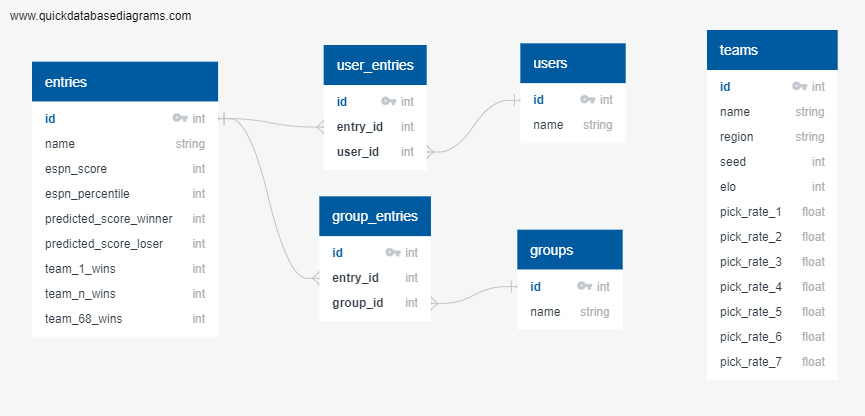

## Further Reading

- [Quick Workflow](#quick-workflow)
- [Running Locally When No Data Is Available](#running-locally-when-no-data-is-available)
- [Database Schema](#database-schema)

# Quick Local Workflow
If all you want to do is change the number of simulations, entries, gender, or scoring system, All you need to do is open *app.py* and change the parameters at the very top of the script:

Simulations and entries can be changed to any value as long as your patient enough to wait for them to complete. The default values are set as such because heroku times out after 30 seconds so the analysis needs to be complete in that time with the program as currently written. There are ways to work around this, but I opted to have the program as is as I feel it's a good enough showcase of what I'm trying to do.

Currently there is only data available for the year of 2019.  Unfortunately I know of no repository of bracket entries prior to that date, although the team power pick percentage data goes back to 2016, and 2018, respectively, So limited command-line functionality is available for those years.Should a data set become available for past or future years, the workflow laid out in the next section can be followed.

Three scoring systems are implemented currently, new scoring systems can be added easily. The number of points for winning a round for each of the implemented scoring systems is as follows:

| Scoring System | Round of 64 | Round of 32 | Sweet 16 | Elite 8 | Final Four | Championship |
|----------------|-------------|-------------|----------|---------|------------|--------------|
| ESPN           | 10          | 20          | 40       | 80      | 160        | 320          |
| wins_only      | 1           | 1           | 1        | 1       | 1          | 1            |
| degen_bracket  | 2           | 3           | 5        | 8       | 13         | 21           |

# Running Locally When No Data Is Available
The general workflow if downloading yourself for a data set with no data is below.  The use case for this would be updating this tool for a new year. For example, 2021.

1. Gather team data from 538 and ESPN 
   * Run `check_if_data_exists()` from who_picked_scrape.py in /web_scraper 
     * Output should be *\<year>_\<gender>_who_picked.csv* and *\<year>_fivethirtyeight_ncaa_forecasts.csv* in team_data folder.
   * Run `csv_combine(<year>)` from team_csv_combine.py in /team_data. 
     * Output should be *\<year>_all_prepped_data.csv*

2. Scrape high-level bracket data from ESPN  
   * Run `ds.TopLevelScrape().main(PROXY, <bracket>)` from *data_scrape_main.py* in */web_scraper*  
     * You may need to fetch a group from ESPN following the same format as the example brackets given  
     * Output should be *resultsPgi<#>.json* in *\<gender>\<year>/top-level_results/\<bracket_name>*
   * `Run ds.BracketScrape().pass_to_consolidated(PROXY, <bracket>)` from  *data_scrape_main.py* in */web_scraper*
     * Output should be *\<bracket_prefix>_consolidated.json* in */bracket_results*

3. Extract preliminary pick value data
   * Run `model.batch_simulate()` after creating a model with a nominal number of simulations (100-10000 is fine)
   * `model.create_json_files()` Will create *chalk.json*, *empty.json*, *reverse_lookup.json*, *preliminary_results.json*. 
     * You must fill in the information missing (wins for play in teams that lost must be set to 0 in the chalk and empty files, Overall number one and two seeds in the chalk file should be set to seven and six wins respectively. If you're doing a retrospective analysis and want to look at how things compared to the actual results, you need to fill out the actual.json file as well)
     * The *preliminary_results.json* file may have some issues if team abbreviations are inconsistent During bracket scraping.  For example, LSU/Louisiana State, Abilene Christian/ACU, etc.  You will need to duplicate dictionaries for each spelling to point to the right place.

4. Run analysis of model
   * Model should now be able to run and output results.  The workflow detailed in the main function in the *model.py* script will output a dataframe with simulation results for a number of randomly selected brackets as well as the entries developed based on just picking chalk teams, picking the most popular teams, and picking the teams with the most expected points. 
   * The number of Entries analyzed can be determined using the `model.add_bulk_entries_from_database(number_of_entries)` method.

5. Visualize data
   * Running *app.py* will run a local server visualizing the data in various ways.  
   * The data can also be found online at http://cd-march-madness.herokuapp.com/

# Database Info

The database(s) are hosted in */db/\<gender>\<year>.db*.  SQLite3 was used to create the databases.  The schema for the databases are shown below:

While the current project only uses data from the entries table, far more Information can be gleaned from the data scraped to enhance the output of the simulator.  For example, if you wanted to simulate a bracket pool comprised of fans of a given team, you could join the entries table with the groups table to simulate using only brackets that are part of the "Fans of \<x>" group.  A few sample queries to show what other sort of information can be gleaned can be found in [queries.sql](/db/queries.sql).  

Note: The original men's database was over 300 MB and consisted of over 1 million entries. The men's 2019 database hosted on get home is a subset of that, consisting of only 20,000 entries, with none of the associated user or group information if you want access to the full database, you can reproduce it following the workflow above, or feel free to reach out to me at codydegen+dev@gmail.com.